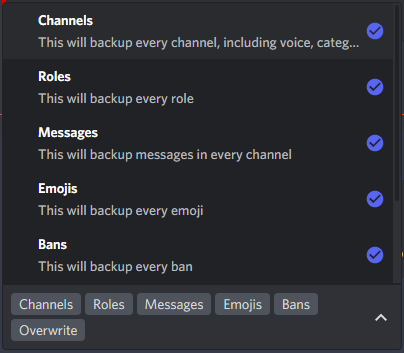
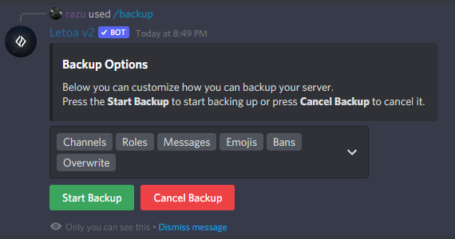

# Backups

How to create backups using the Letoa discord bot.

## Invite The Bot

You may invite the bot where you want to create a backup by using [this link](https://letoa.me/bot). And you must link up your `Letoa Account` to your discord account before attempting any other steps as it would result in a failure.

## Run the command

Go to your desinated channel and run the command `/backup`. You will be prompted with multiple options for your backup. These options include:

-   Channels
-   Roles
-   Messages
-   Emojis
-   Bans
-   :star: Member Roles + Nicknames

?> Member Roles & Nicknames are only available for Gold Plans and above.

 

## After running the command

You may choose your options then press the `Start Backup` button which will start to backup the entirety of your server. And once it has completed, it will then send a message confirming it backed up or if it failed.

!> If it has failed, you will be provided with a `Error Code`. Please join our [support server](https://discord.letoa.me) and create a ticket explaining how the error occurred and provide the `Error Code`.
