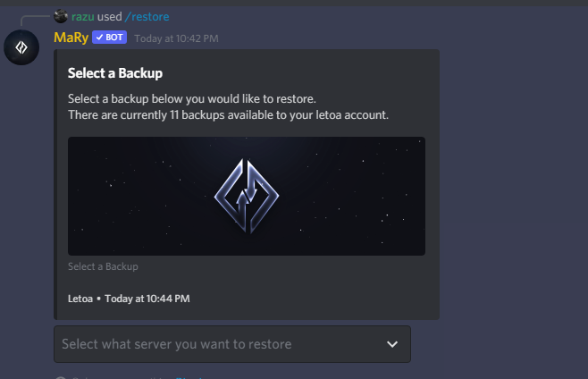
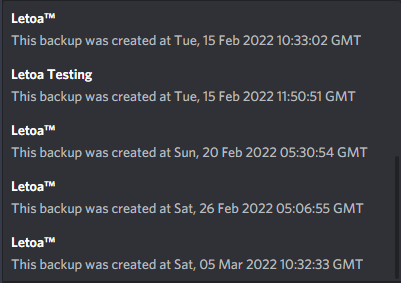
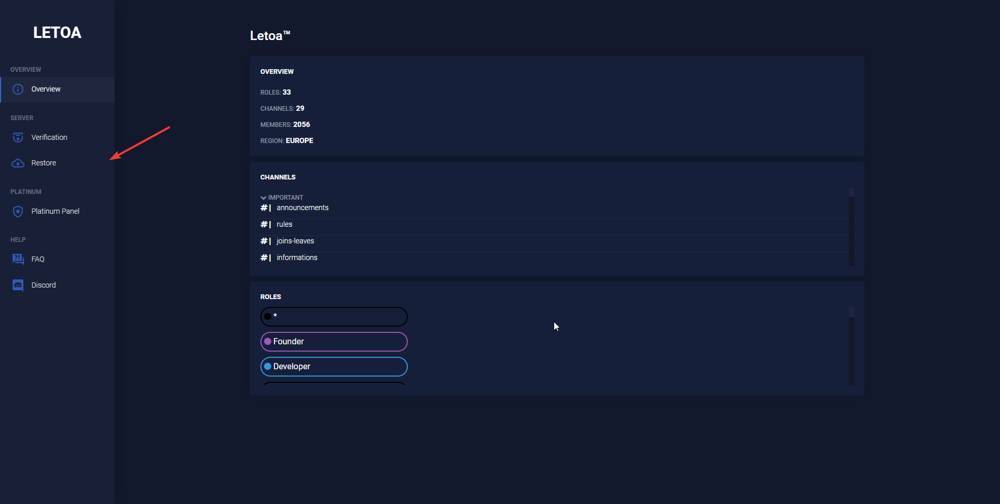
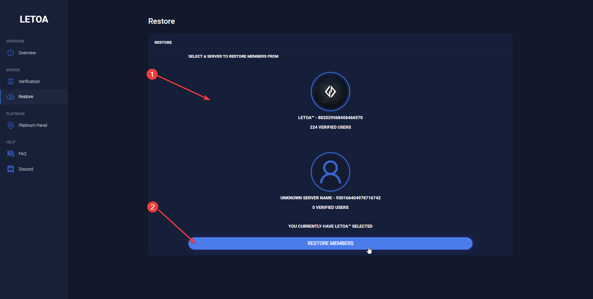

# Restoring

## Restore Server

To restore your server, you must once again invite the bot to your new server and make sure your `Letoa Account` is linked up to your current discord account.

Then run the following command `/restore`. This will prompt you with multiple backups you have created with your letoa account. Once you select a backup, it will swiftly restore your messages.

 

?> If you have a **Premium Plan** that includes lots of messages, it may take longer to restore your messages due to ratelimits etc.

## Restore Members

To restore your members, you must login in to the `Letoa Dashboard` and find your new server with the bot in it. Then go to the `Restore` tab, and once again find your server linked with all your members, and click restore. This will start the restoration process and may take a while to complete depending on how many members you have.

 

!> If you have members from the old Letoa bot, you must also have that bot in the server as well.
