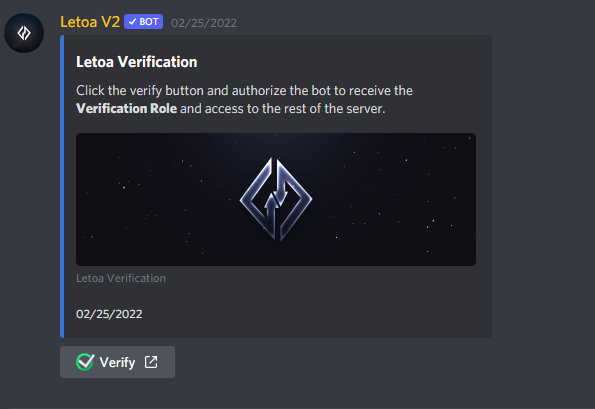

# Verification

## Create a Channel

You may create a channel where new users can go to and find your verification link.

Or you may also use one of our commands `/setup channel: #your_channel`. This command will post an embed of your verification link making it seem less sketchy.

## Update the permission overwrites

Below should be what your permission overwrites looks like for your verification channel.

|     Role      |    View Channel    | Send Messages |
| :-----------: | :----------------: | :-----------: |
|   @everyone   | :heavy_check_mark: |      :x:      |
| Verified Role |        :x:         |      :x:      |

### Public Channels

After your user has verified, they will be given a role. This will most likely be the verification you have configured in the `Letoa Dashboard`.

You also need to make sure they can see the rest of the server, so for every channel other than the verify channel, configure your permission overwrites to:

|     Role      |    View Channel    |   Send Messages    |
| :-----------: | :----------------: | :----------------: |
|   @everyone   |        :x:         |        :x:         |
| Verified Role | :heavy_check_mark: | :heavy_check_mark: |

?> You may decide if you want to send messages in that channel, if you dont want them sending messages, keep it false.

## Logging Channel

Your logging channel will show all your verified users and users that have failed to verify within your server. You may always view your verified users across all of your servers [here](https://letoa.me/dashboard/account/users).

